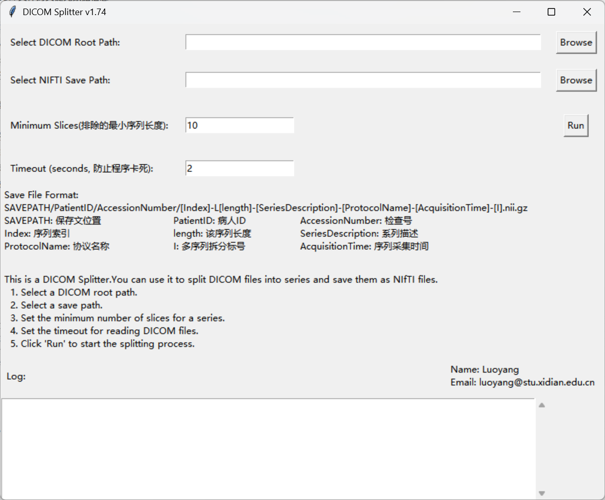

# DICOM Splitter v1.74 使用说明文档

## 项目概述

DICOM Splitter 是一个用于将 DICOM 医学影像文件按照序列（Series）进行分割并转换为 NIfTI 格式的工具。该工具提供了图形化用户界面（GUI），支持批量处理 DICOM 文件，并能够自动识别和过滤不需要的序列。

## 界面预览



## 功能特性

- **自动读取 DICOM 文件**：递归扫描指定目录下的所有 DICOM 文件
- **元数据提取**：自动提取 DICOM 文件的关键元数据信息
- **智能序列分割**：
  - 根据 `SeriesInstanceUID` 分组
  - 支持基于 `AcquisitionNumber` 的多序列拆分
  - 支持基于 `SliceLocation` 的多序列拆分
  - 自动判断使用哪种拆分方式
- **序列过滤**：
  - 通用过滤规则（定位像、处理图像等）
  - 厂商特定过滤规则（Philips、GE、SIEMENS）
- **文件命名**：自动生成规范的文件夹和文件名
- **格式转换**：将 DICOM 序列转换为 NIfTI (.nii.gz) 格式
- **日志记录**：完整的日志记录功能，支持文件日志和 GUI 显示
- **超时保护**：防止程序因读取大量文件而卡死

## 系统要求

- Python 3.6+
- Windows/Linux/macOS

## 依赖库

```bash
pydicom          # DICOM 文件读取
loguru           # 日志记录
func_timeout     # 超时控制
SimpleITK        # 医学影像处理
tkinter          # GUI 界面（Python 标准库）
```

安装依赖：

```bash
pip install pydicom loguru func_timeout SimpleITK
```

## 使用方法

### GUI 界面使用

1. **启动程序**

   ```bash
   python app.1.74.py
   ```
2. **选择路径**

   - **DICOM Root Path**：选择包含 DICOM 文件的根目录
   - **NIFTI Save Path**：选择保存 NIfTI 文件的目录
3. **设置参数**

   - **Minimum Slices**：最小序列长度，少于该数量的序列将被跳过（默认：10）
   - **Timeout**：读取 DICOM 文件的超时时间（秒），防止程序卡死（默认：2）
4. **运行**

   - 点击 "Run" 按钮开始处理
   - 处理过程会在日志区域显示
   - 处理完成后会弹出提示框

### 编程接口使用

```python
from app import DicomSeriesSplit

# 创建分割器实例
splitter = DicomSeriesSplit(
    timeout=4,                    # 超时时间（秒）
    min_slices=24,                # 最小序列长度
    will_save_root_path="/path/to/save",  # 保存路径
    will_save_file_keys=["SeriesDescription", "ProtocolName", "AcquisitionTime"],
    will_save_folder_keys=["PatientID", "AccessionNumber"]
)

# 处理 DICOM 文件
split_list = splitter("/path/to/dicom/files")

# 保存为 NIfTI
for series_data in split_list:
    series_data.to_save_nifti()
```

## 参数说明

### DicomSeriesSplit 类参数

| 参数                      | 类型     | 默认值                           | 说明                                   |
| ------------------------- | -------- | -------------------------------- | -------------------------------------- |
| `timeout`               | int      | 4                                | 读取 DICOM 文件的超时时间（秒）        |
| `n_jobs`                | int      | 4                                | 并行处理任务数（当前版本未使用）       |
| `backend`               | str      | None                             | 并行处理后端（当前版本未使用）         |
| `min_slices`            | int      | 24                               | 最小序列长度，少于该数量的序列将被跳过 |
| `skip_desc`             | set      | None                             | 要跳过的序列描述集合                   |
| `filter_func`           | function | None                             | 自定义过滤函数                         |
| `meta_keys`             | list     | None                             | 要提取的元数据键列表                   |
| `will_save_file_keys`   | list     | ["SeriesDescription"]            | 用于文件名的元数据键                   |
| `will_save_folder_keys` | list     | ["PatientID", "AccessionNumber"] | 用于文件夹名的元数据键                 |
| `will_save_root_path`   | str      | None                             | 保存文件的根路径（必需）               |

## 文件命名规则

### 文件夹结构

```
SAVEPATH/
  └── PatientID/
      └── AccessionNumber/
          └── [Index]-L[length]-[SeriesDescription]-[ProtocolName]-[AcquisitionTime]-[I].nii.gz
```

### 文件名格式

```
[Index]-L[length]-[SeriesDescription]-[ProtocolName]-[AcquisitionTime]-[I].nii.gz
```

**字段说明：**

- `SAVEPATH`：保存文件位置
- `PatientID`：病人ID
- `AccessionNumber`：检查号
- `Index`：序列索引（从0开始，每个病人/检查号重置）
- `length`：该序列的切片数量（3位数字，如 001, 024）
- `SeriesDescription`：系列描述
- `ProtocolName`：协议名称
- `AcquisitionTime`：序列采集时间
- `I`：多序列拆分标号（使用 AcquisitionNumber 或 SliceLocation 拆分时的序号）

**示例：**

```
00-L024-Ax_T1_TSE-ABD_CARDIAC-154502-0.nii.gz
01-L030-Ax_T2_TSE-ABD_CARDIAC-154503-1.nii.gz
```

## 序列拆分逻辑

### 1. 分组

- 根据 `SeriesInstanceUID` 将 DICOM 文件分组

### 2. 拆分策略选择

程序会自动判断使用哪种拆分方式：

**使用 AcquisitionNumber 拆分：**

- 当 `AcquisitionNumber` 不唯一时
- 且满足特定条件（避免同反相位等特殊情况）
- 按不同的 `AcquisitionNumber` 值拆分序列

**使用 SliceLocation 拆分：**

- 当 `AcquisitionNumber` 唯一或不符合拆分条件时
- 根据 `SliceLocation` 和 `InstanceNumber` 排序
- 自动丢弃只有一个切片的 `SliceLocation`
- 按 `SliceLocation` 分组拆分序列

### 3. 过滤规则

**通用过滤（所有厂商）：**

- localizer（定位像）
- 3-pl loc / 3-pl loc ssfse / 3-pl ssfse loc
- processed images（处理图像）
- screen save
- default ps series
- survey

**Philips 特定过滤：**

- 包含 "RECON" 的序列描述
- 等于以下值的序列描述：IN, OP, WATER, ALL, A1, A2, A60, V60, 3min, 8min

**GE 特定过滤：**

- 包含以下关键字的序列描述：ORIG, MPR, Refomate, IDEAL IQ
- 等于特定序列描述的序列（如 LAVA 系列、Water、inphase、outphase 等）

**SIEMENS 特定过滤：**

- 包含 "Map" 的序列描述
- 等于特定序列描述的序列（如各种 vibe 和 dixon 序列）

## 代码结构

### 主要类和函数

1. **`get_dicom_file(root_path, timeout=2)`**

   - 递归获取目录下所有 DICOM 文件
   - 带超时保护
2. **`get_metadata(dicom_file, meta_keys=None)`**

   - 提取 DICOM 文件的元数据
   - 处理缺失值和异常情况
3. **`filter_in(x: dict)`**

   - 根据序列描述和厂商信息过滤序列
   - 返回 True 表示保留，False 表示过滤
4. **`sanitize_file_name(file_name)`**

   - 清理文件名，移除非法字符
   - 将非法字符替换为下划线
5. **`DicomSeriesSplit` 类**

   - 核心分割逻辑
   - 处理序列分组、拆分、过滤
6. **`SeriesData` 类**

   - 存储单个序列的数据
   - 提供转换为 ITK 图像和保存为 NIfTI 的方法
7. **`DicomApp` 类**

   - GUI 界面
   - 用户交互和日志显示

## 日志系统

程序使用 `loguru` 进行日志记录：

- **文件日志**：保存在 `log/dicom_splitter_app.log`，自动轮转（100 MB）
- **GUI 日志**：实时显示在应用程序的日志区域

日志级别包括：

- INFO：正常操作信息
- WARNING：警告信息（如缺失元数据）
- ERROR：错误信息

## 注意事项

1. **文件路径**

   - 确保 DICOM 文件路径可访问
   - 确保保存路径有写入权限
   - 路径中的非法字符会被自动处理
2. **元数据要求**

   - DICOM 文件必须包含 `AccessionNumber` 或 `StudyID`
   - 必须包含 `SliceLocation` 和 `AcquisitionTime`
   - 缺失关键元数据的文件会被跳过
3. **序列长度**

   - 少于 `min_slices` 的序列会被自动跳过
   - 建议根据实际需求设置合适的 `min_slices` 值
4. **超时设置**

   - 如果目录包含大量文件，可能需要增加 `timeout` 值
   - 如果遇到超时错误，可以适当增加超时时间
5. **文件覆盖**

   - 如果目标文件已存在，程序会跳过保存并记录日志
   - 不会覆盖已存在的文件
6. **多序列拆分**

   - 程序会自动判断使用 `AcquisitionNumber` 还是 `SliceLocation` 拆分
   - 对于同反相位等特殊情况，会优先使用 `SliceLocation` 拆分以避免错误

## 打包为可执行文件

使用 PyInstaller 打包：

```bash
pyinstaller -F -w --hiddenimport=pydicom.encoders.gdcm --hiddenimport=pydicom.encoders.pylibjpeg app.1.74.py -n DicomSplitter1.74.exe
```

参数说明：

- `-F`：打包为单个可执行文件
- `-w`：无控制台窗口（GUI 模式）
- `--hiddenimport`：隐藏导入的模块
- `-n`：输出文件名

## 版本信息

- **当前版本**：1.74
- **更新说明**：
  - 修复了同反相位序列拆分错误的问题
  - 增加了对 AcquisitionNumber 和 SliceLocation 同时存在情况的判断条件
  - 优化了拆分逻辑，避免使用 AcquisitionNumber 拆分导致的错误

## 开发者信息

- **开发者**：Luoyang
- **邮箱**：luoyang@stu.xidian.edu.cn

## 常见问题

### Q: 程序提示 "Timeout when reading" 错误

A: 增加 `timeout` 参数值，或检查路径是否正确

### Q: 某些序列没有被处理

A: 检查序列是否被过滤规则过滤，或序列长度是否小于 `min_slices`

### Q: 文件保存失败

A: 检查保存路径的写入权限，确保有足够的磁盘空间

### Q: 序列拆分不正确

A: 检查 DICOM 文件的 `AcquisitionNumber` 和 `SliceLocation` 是否正确，可能需要调整拆分逻辑

## 许可证

本项目采用 **MIT License** 许可证。

- **版权归属**：Copyright (c) 2026 Foursheeps
- **许可证类型**：MIT License（宽松开源许可证）
- **允许行为**：
  - 商业和非商业使用
  - 修改和分发
  - 私有使用
  - 包含专有软件
- **要求**：必须在所有副本中包含版权声明和许可证声明
- **免责声明**：软件按"原样"提供，不提供任何明示或暗示的担保

完整的许可证文本请参阅项目根目录的 `LICENSE` 文件。

---

**最后更新**：2024年
