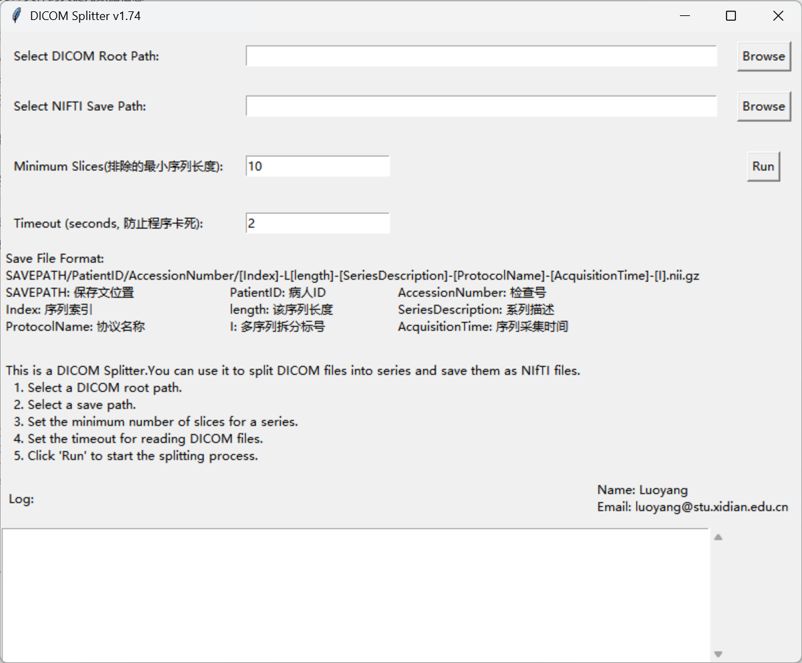

# DICOM Splitter v1.76 使用说明文档

## 项目概述

DICOM Splitter 是一个用于将 DICOM 医学影像文件按照序列（Series）进行分割并转换为 NIfTI 格式的工具。该工具提供了图形化用户界面（GUI），支持批量处理 DICOM 文件，并能够自动识别和过滤不需要的序列。

## 界面预览



## 功能特性

- **自动读取 DICOM 文件**：递归扫描指定目录下的所有 DICOM 文件，支持多种 DICOM 格式
- **元数据提取**：自动提取 DICOM 文件的关键元数据信息，处理缺失值和异常情况
- **智能序列分割**：
  - 根据 `SeriesInstanceUID` 分组
  - 支持基于 `AcquisitionNumber` 的多序列拆分（带智能判断，避免同反相位拆分错误）
  - 支持基于 `SliceLocation` 的多序列拆分（浮点精度容差处理）
  - 自动判断使用哪种拆分方式
- **序列过滤**：
  - 通用过滤规则（定位像、处理图像、剂量报告等）
  - 厂商特定过滤规则（Philips、GE、SIEMENS）
  - 支持自定义过滤函数
- **文件命名**：自动生成规范的文件夹和文件名，自动清理非法字符
- **格式转换**：将 DICOM 序列转换为压缩 NIfTI (.nii.gz) 格式
- **日志记录**：完整的日志记录功能，支持文件日志（自动轮转）和 GUI 实时显示
- **超时保护**：防止程序因读取大量文件或损坏文件而卡死
- **并行处理**：多线程并行读取元数据，提高处理速度
- **权限检查**：自动检查保存路径的写入权限

## 系统要求

- Python 3.7+
- Windows/Linux/macOS
- 推荐 4GB 以上内存（处理大型数据集时）

## 依赖库

```bash
pydicom          # DICOM 文件读取
loguru           # 日志记录
func_timeout     # 超时控制
SimpleITK        # 医学影像处理
tkinter          # GUI 界面（Python 标准库）
```

安装依赖：

```bash
pip install pydicom loguru func_timeout SimpleITK
```

## 使用方法

### GUI 界面使用

1. **启动程序**

   ```bash
   python app.py
   ```

2. **选择路径**

   - **DICOM Root Path**：选择包含 DICOM 文件的根目录（支持递归扫描）
   - **NIFTI Save Path**：选择保存 NIfTI 文件的目录

3. **设置参数**

   - **Minimum Slices**：最小序列长度，少于该数量的序列将被跳过（默认：10）
   - **Timeout (s)**：读取单个 DICOM 文件的超时时间（秒），防止程序卡死（默认：2）
   - **Threads**：并行处理线程数（默认：4，可根据 CPU 核心数调整）

4. **运行**

   - 点击 "Run" 按钮开始处理
   - 处理过程会在日志区域实时显示
   - 处理完成后会弹出提示框显示处理结果

### 编程接口使用

```python
from app import DicomSeriesSplit

# 创建分割器实例
splitter = DicomSeriesSplit(
    timeout=4,                    # 单个文件读取超时时间（秒）
    min_slices=24,                # 最小序列长度
    n_jobs=8,                     # 并行处理线程数（默认：4）
    will_save_root_path="/path/to/save",  # 保存路径
    will_save_file_keys=["SeriesDescription", "ProtocolName", "AcquisitionTime"],
    will_save_folder_keys=["PatientID", "AccessionNumber"]
)

# 处理 DICOM 文件
split_list = splitter("/path/to/dicom/files")

# 保存为 NIfTI
for series_data in split_list:
    saved_path = series_data.to_save_nifti()
    if saved_path:
        print(f"保存成功: {saved_path}")
```

### 高级用法 - 自定义过滤

```python
from app import DicomSeriesSplit

# 自定义过滤函数
def custom_filter(metadata: dict) -> bool:
    """返回 True 保留序列，False 过滤序列"""
    desc = metadata.get("SeriesDescription", "").lower()
    # 只保留 T1 加权图像
    return "t1" in desc

splitter = DicomSeriesSplit(
    filter_func=custom_filter,
    min_slices=10,
    will_save_root_path="/path/to/save"
)

split_list = splitter("/path/to/dicom")
```

## 参数说明

### DicomSeriesSplit 类参数

| 参数                      | 类型     | 默认值                           | 说明                                   |
| ------------------------- | -------- | -------------------------------- | -------------------------------------- |
| `timeout`               | int      | 2                                | 读取单个 DICOM 文件的超时时间（秒）    |
| `n_jobs`                | int      | 4                                | 并行处理线程数                         |
| `backend`               | str      | None                             | 并行处理后端（预留参数）               |
| `min_slices`            | int      | 10                               | 最小序列长度，少于该数量的序列将被跳过 |
| `skip_desc`             | set      | None                             | 要跳过的序列描述集合（小写）           |
| `filter_func`           | function | `filter_in`                      | 自定义过滤函数，返回 True 表示保留     |
| `meta_keys`             | list     | None                             | 要提取的元数据键列表                   |
| `will_save_file_keys`   | list     | ["SeriesDescription", "ProtocolName", "AcquisitionTime"] | 用于文件名的元数据键 |
| `will_save_folder_keys` | list     | ["PatientID", "AccessionNumber"] | 用于文件夹名的元数据键                 |
| `will_save_root_path`   | str      | None                             | 保存文件的根路径（必需）               |

## 文件命名规则

### 文件夹结构

```
SAVEPATH/
  └── PatientID/
      └── AccessionNumber/
          └── [Index]-L[length]-[SeriesDescription]-[ProtocolName]-[AcquisitionTime]-[I].nii.gz
```

### 文件名格式

```
[Index]-L[length]-[SeriesDescription]-[ProtocolName]-[AcquisitionTime]-[I].nii.gz
```

**字段说明：**

- `SAVEPATH`：保存文件位置
- `PatientID`：病人ID
- `AccessionNumber`：检查号（如果缺失则使用 StudyID）
- `Index`：序列索引（从0开始，每个病人/检查号重置）
- `length`：该序列的切片数量（3位数字，如 001, 024, 128）
- `SeriesDescription`：系列描述（自动清理非法字符）
- `ProtocolName`：协议名称（自动清理非法字符）
- `AcquisitionTime`：序列采集时间（HHMMSS 格式）
- `I`：多序列拆分标号（使用 AcquisitionNumber 或 SliceLocation 拆分时的序号）

**示例：**

```
00-L024-Ax_T1_TSE-ABD_CARDIAC-154502-0.nii.gz
01-L030-Ax_T2_TSE-ABD_CARDIAC-154503-1.nii.gz
```

## 序列拆分逻辑

### 1. 分组

- 根据 `SeriesInstanceUID` 将 DICOM 文件分组
- 如果 `SeriesInstanceUID` 缺失，使用 `StudyID` + `SeriesDescription` 组合
- 过滤掉不符合规则的序列（定位像、处理图像等）

### 2. 拆分策略选择

程序会自动判断使用哪种拆分方式：

**使用 AcquisitionNumber 拆分：**
- 当 `AcquisitionNumber` 不唯一时
- 且不是同反相位等特殊序列
- 且每个 AcquisitionNumber 的切片数不少于阈值
- 按不同的 `AcquisitionNumber` 值拆分序列

**使用 SliceLocation 拆分：**
- 当 `AcquisitionNumber` 唯一或不符合拆分条件时
- 当有足够多的重复 SliceLocation 时
- 使用浮点精度容差（0.001）比较 SliceLocation
- 按 `SliceLocation` 分组拆分序列
- 自动过滤掉切片数太少的分组

### 3. 过滤规则

**通用过滤（所有厂商）：**
- localizer / survey / scout（定位像）
- 3-pl loc / 3-pl loc ssfse / 3-pl ssfse loc
- processed images（处理图像）
- screen save
- default ps series
- dose report / dose info / dose summary（剂量报告）

**Philips 特定过滤：**
- 包含 "RECON" 的序列描述
- 等于以下值的序列描述：IN, OP, WATER, ALL, A1, A2, A60, V60, 3min, 8min

**GE 特定过滤：**
- 包含以下关键字的序列描述：ORIG, MPR, Refomate, Reformate, IDEAL IQ, calibration
- 等于特定序列描述的序列（如 LAVA 系列、Water、inphase、outphase 等）

**SIEMENS 特定过滤：**
- 包含 "Map", "B0Map", "B1Map", "FieldMap" 的序列描述
- 等于特定序列描述的序列（如各种 vibe 和 dixon 序列）

## 代码结构

### 主要类和函数

1. **`sanitize_file_name(file_name)`**
   - 清理文件名，移除非法字符
   - 限制文件名长度，避免路径过长

2. **`safe_get(dicom_obj, tag, default)`**
   - 安全地获取 DICOM 属性值
   - 处理空值、多值和异常情况

3. **`is_dicom_file(file_path, timeout)`**
   - 检查文件是否为有效的 DICOM 文件
   - 支持有/无前缀的 DICOM 文件

4. **`get_dicom_file(root_path, timeout=2)`**
   - 递归获取目录下所有 DICOM 文件
   - 带超时保护，跳过损坏文件
   - 自动过滤非 DICOM 文件

5. **`get_metadata(dicom_file, meta_keys=None)`**
   - 提取 DICOM 文件的元数据
   - 自动处理数字类型和时间格式
   - 处理缺失值和异常情况

6. **`filter_in(x: dict)`**
   - 根据序列描述和厂商信息过滤序列
   - 返回 True 表示保留，False 表示过滤

7. **`DicomSeriesSplit` 类**
   - 核心分割逻辑
   - 处理序列分组、拆分、过滤
   - 支持并行读取元数据

8. **`SeriesData` 类**
   - 存储单个序列的数据
   - 提供转换为 ITK 图像和保存为 NIfTI 的方法
   - 自动处理文件路径和权限

9. **`DicomApp` 类**
   - GUI 界面
   - 用户交互和日志实时显示
   - 输入验证和错误提示

## 日志系统

程序使用 `loguru` 进行日志记录：

- **文件日志**：保存在 `log/dicom_splitter_app.log`，自动轮转（100 MB），保留 30 天
- **GUI 日志**：实时显示在应用程序的日志区域，支持自动滚动

日志级别包括：
- `INFO`：正常操作信息
- `WARNING`：警告信息（如缺失元数据、文件已存在）
- `ERROR`：错误信息（如文件读取失败、保存失败）
- `DEBUG`：调试信息（仅记录到文件）

## 注意事项

1. **文件路径**
   - 确保 DICOM 文件路径可访问
   - 确保保存路径有写入权限（程序会自动检查）
   - 路径中的非法字符会被自动处理为下划线

2. **元数据要求**
   - 建议 DICOM 文件包含 `SeriesInstanceUID` 用于分组
   - 建议包含 `AcquisitionNumber` 或 `SliceLocation` 用于拆分
   - 缺失关键元数据的文件不会导致程序崩溃，但可能被跳过

3. **序列长度**
   - 少于 `min_slices` 的序列会被自动跳过
   - 建议根据实际需求设置合适的 `min_slices` 值（推荐 10-30）

4. **超时设置**
   - 如果目录包含大量文件或大文件，可能需要增加 `timeout` 值
   - 如果遇到大量超时错误，可以适当增加超时时间（建议 2-10 秒）

5. **文件覆盖**
   - 如果目标文件已存在，程序会跳过保存并记录日志
   - 不会覆盖已存在的文件，避免数据丢失

6. **多序列拆分**
   - 程序会自动判断使用 `AcquisitionNumber` 还是 `SliceLocation` 拆分
   - 对于同反相位等特殊情况，会优先使用 `SliceLocation` 拆分以避免错误
   - SliceLocation 比较使用 0.001 的浮点精度容差

7. **内存使用**
   - 处理大型数据集时，建议增加系统内存
   - 程序会自动释放已处理的文件内存

## 打包为可执行文件

使用 PyInstaller 打包：

```bash
pyinstaller -F -w --hiddenimport=pydicom.encoders.gdcm --hiddenimport=pydicom.encoders.pylibjpeg app.py -n DicomSplitter1.76.exe
```

参数说明：
- `-F`：打包为单个可执行文件
- `-w`：无控制台窗口（GUI 模式）
- `--hiddenimport`：隐藏导入的模块（解决 pydicom 编码问题）
- `-n`：输出文件名

**高级打包选项**（包含所有依赖）：

```bash
pyinstaller -F -w \
  --hiddenimport=pydicom.encoders.gdcm \
  --hiddenimport=pydicom.encoders.pylibjpeg \
  --hiddenimport=pydicom.encoders.rle \
  --collect-all SimpleITK \
  app.py -n DicomSplitter1.76.exe
```

## 版本信息

- **当前版本**：1.76
- **更新日期**：2026-03-05
- **更新说明**：
  - 修复了 GUI 日志处理器重复添加的问题
  - 修复了多线程处理时的竞态条件
  - 优化了 `safe_get` 函数对多值的处理
  - 改进了空值和边界检查
  - 优化了 DICOM 文件检测逻辑
  - 增加了后台线程处理，避免 GUI 卡死
  - 改进了错误处理和用户提示
  - 优化了内存使用和文件句柄管理
  - 增加了更多输入验证

## 开发者信息

- **开发者**：Luoyang
- **邮箱**：luoyang@stu.xidian.edu.cn
- **项目地址**：[GitHub 仓库]

## 常见问题

### Q: 程序提示 "Timeout when reading" 错误
A: 单个文件读取超时，可能是文件太大或损坏。可以适当增加 `timeout` 参数值，或检查文件是否完整。

### Q: 某些序列没有被处理
A: 可能的原因：
   - 序列被过滤规则过滤（如定位像、剂量报告等）
   - 序列长度小于 `min_slices` 设置
   - 序列缺少必要的元数据（如 SeriesInstanceUID）
   - 文件损坏无法读取

### Q: 文件保存失败
A: 检查保存路径的写入权限，确保有足够的磁盘空间。程序会在运行前自动检查写入权限。

### Q: 序列拆分不正确
A: 检查 DICOM 文件的 `AcquisitionNumber` 和 `SliceLocation` 是否正确。如果是同反相位序列，程序会自动选择更合适的拆分方式。

### Q: 处理速度太慢
A: 可以增加 `n_jobs` 参数值（并行线程数），或者减少 `timeout` 值。对于非常大的数据集，建议使用命令行模式处理。

### Q: 文件名中有很多下划线
A: 这是正常现象，程序会自动将文件名中的非法字符替换为下划线，避免保存失败。

### Q: 程序崩溃或无响应
A: 可能是以下原因：
   - 内存不足（尝试关闭其他程序）
   - 文件权限问题
   - 磁盘空间不足
   - 遇到不兼容的 DICOM 格式

## 许可证

本项目采用 **MIT License** 许可证。

- **版权归属**：Copyright (c) 2026 Foursheeps
- **许可证类型**：MIT License（宽松开源许可证）
- **允许行为**：
  - 商业和非商业使用
  - 修改和分发
  - 私有使用
  - 包含专有软件
- **要求**：必须在所有副本中包含版权声明和许可证声明
- **免责声明**：软件按"原样"提供，不提供任何明示或暗示的担保

完整的许可证文本请参阅项目根目录的 `LICENSE` 文件。

---

**最后更新**：2026-03-05
